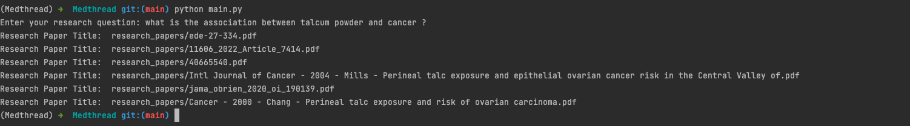

# Medthread

STEPS FOLLOWED TO ARRIVE AT A SOLUTION

STEP 1

1) Imported a code that provides a summary based on the input data given with Deep Learning and Natural Language Processing algorithms. 
2) The code was taken from "https://www.activestate.com/blog/how-to-do-text-summarization-with-python/"
3) We try to summarize a research paper since there is a cap on the input query to the chatgpt api. 

STEP 2

1) We need to build search terms from the query provided. 
2) We use Natural Language Processing to remove stop words from the query and we build a list of search terms 
3) Referred the code to STEP 2 from "https://www.geeksforgeeks.org/removing-stop-words-nltk-python/"

STEP 3

1) At first, I'm making use of api's provided by openai's chatgpt to understand and come up with a conclusion by feeding the research paper as an input. 
2) Api's provided by chatgpt has a threshold of token size 4096 which includes the query and the response that you get. 
3) The model used is  "gpt-3.5-turbo". The next version i.e "gpt-4" will be released shortly and will have a larger threshold. 
4) we built a query which starts with "what is the conclusion from the research" along with the summary that is generated from step 1.

STEP 4

1) the response from STEP 3 is stored in a list with corresponding research paper titles. 
2) Currently we are building key features and search type list manually.

STEP 5

1) We make use of transformer, which is used to perform data preprocessing and feature extraction. 
2) We make use of transform() and fit_transform() function from scikit-learn that will help us to fit the data into a model and transform it into a form that is more suitable for a model in a single step.

STEP 6

1) From the above step we retrieve the vector score for both the conclusion that we get from STEP 3. 
2) We make use of cosine similarity between two vectors and we measure the document similarity in text analysis 
3) If the vector score is greater than 0.5 then we flag the paper as relevant and push it to a list of all relevant papers

STEPS TO EXECUTE THE CODE:

1) all the packages that are required to run this application are stored in conda_requirement.txt and virenv_requirement.txt
2) If you are using conda environment then run the command "conda install --file conda_requirement.txt"
3) If you are using virtual environment then run the command "pip install -r virenv_requirement.txt"
4) And then run "python main.py" and enter the query when prompted.

OUTPUT IMAGE 

